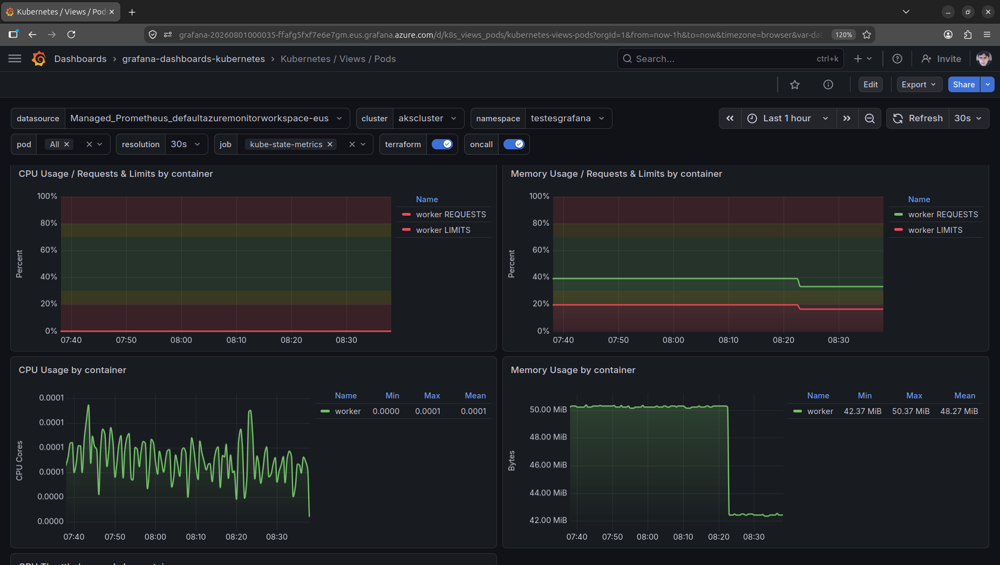
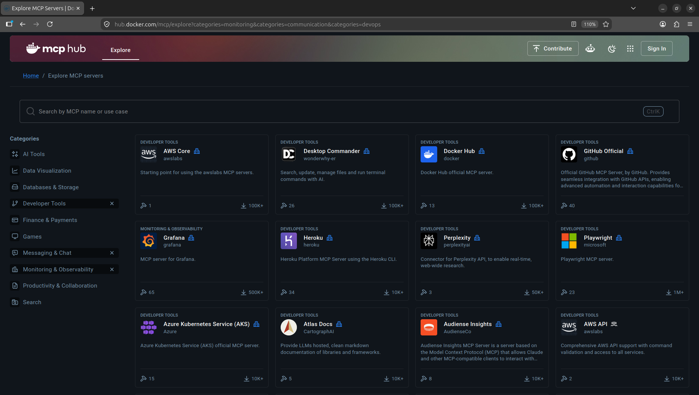

# docker-kubernetes_cloud-weekend-2026-08
Conteúdos da apresentação "Docker e Kubernetes: dicas e truques para descomplicar sua vida ao trabalhar com containers!". Tecnologias abordadas: Kubernetes, Docker, Linux, Azure Kubernetes Service, Grafana, Prometheus, OpenTelemetry, Azure DevOps, KEDA, MCP, Inteligência Artificial, Visual Studio Code...

## Algumas dicas e truques

### Container Tools for Visual Studio Code

Uma alternativa a ferramentas licenciadas.

Link: **https://marketplace.visualstudio.com/items?itemName=ms-azuretools.vscode-containers**

Testes:

```bash
docker run -e "EndpointRequest=https://httpbin.org/get" -d renatogroffe/dotnet10-worker-httprequest:2
```

### Dashboards Grafana + Prometheus monitorando clusters Kubernetes

Dashboards gratuitos: **https://github.com/dotdc/grafana-dashboards-kubernetes**



### Dashboards with Grafana

Nova funcionalidade no Portal do Azure.

### Simplificando a navegação entre clusters com kubectx

Listando os clusters/containers registrados:

```bash
kubectl config get-contexts
```

Configurando o uso de um cluster via kubectl:

```bash
kubectl config use-context <context-name>
```

Link: **https://github.com/ahmetb/kubectx**

### Kor - objetos em desuso num cluster Kubernetes

Link: **https://github.com/yonahd/kor**

### k9s - Monitoramento e gerenciamento de objetos do Kubernetes via interface + linha de comando

Link: **https://k9scli.io/**

### Escalabilidade com KEDA

Link: https://keda.sh/

### Scanning de vulnerabilidades com Trivy

Link: **https://trivy.dev/**

Exemplo: **https://github.com/renatogroffe/trivy_operator-aks-managed_prometheus** 


### Docker MCP Catalog (MCP Servers seguros)

Link: **https://hub.docker.com/mcp**



Utilizando o MCP Server de Kubernetes no VS Code

```json
{
	"servers": {
		"kubernetes": {
			"type": "stdio",
			"command": "npx",
			"args": ["mcp-server-kubernetes"],
			"description": "Kubernetes cluster management and operations"
		}
	},
}
```

### Certificações gratuitas

* Linux Foundation: **https://training.linuxfoundation.org/full-catalog/?_sfm_price=0**

* Grafana: **https://learn.grafana.com/**
